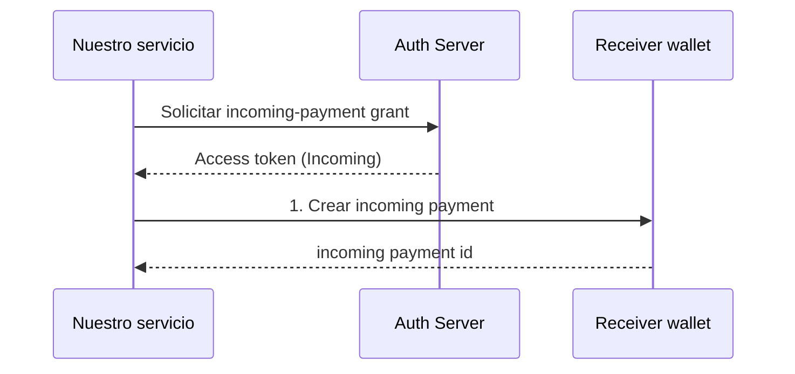
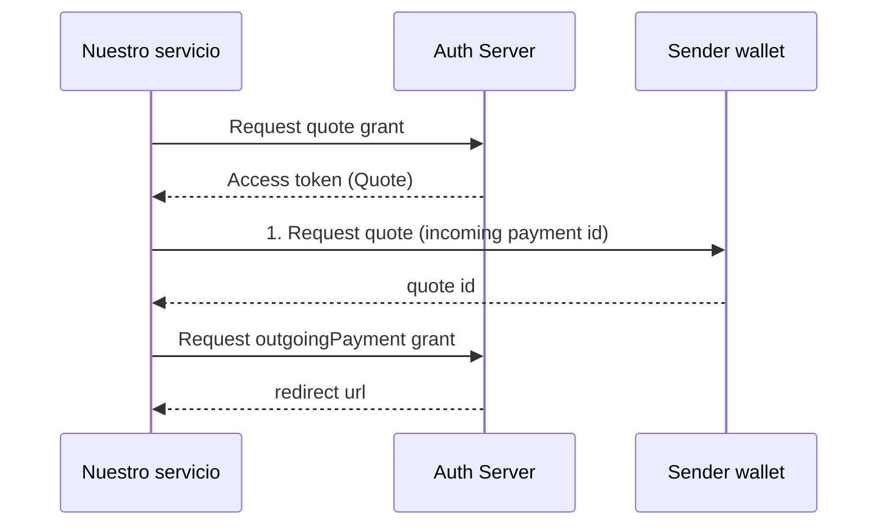
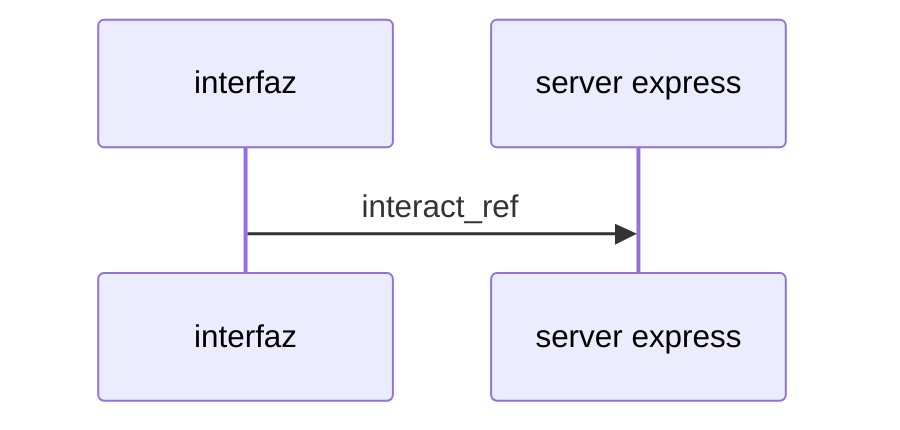
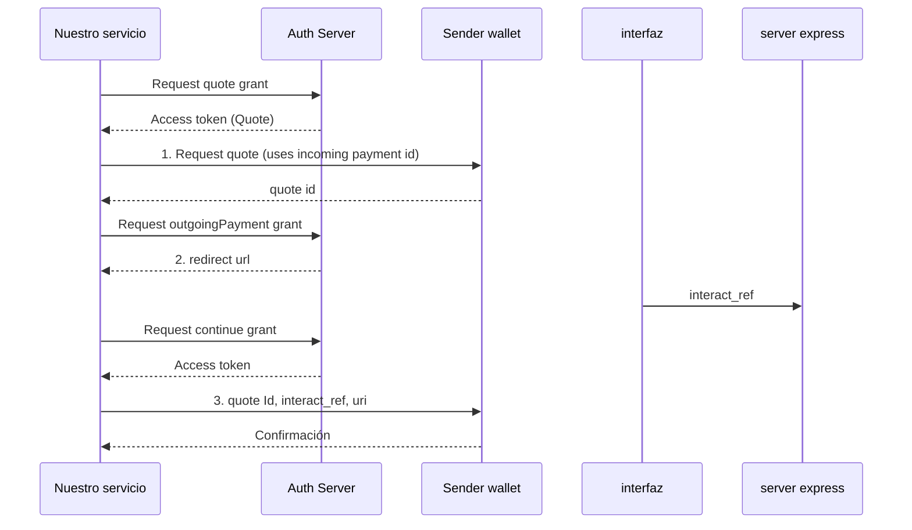

# Interledger: Open Payments

## Que vamos a lograr al final de este taller?

1. Registrarnos en el test wallet de open payments.
2. Crear un wallet para enviar y otro para recibir transferencias.
3. Familiarizarnos con la terminología de interledger.
4. Hacer una transacción desde nuessrto editor mediante entre wallets mediante:
    * **4.1** Configuración del proyecto.
    * **4.2** Configuración de los clientes para crear las transacciones entre wallets.
    * **4.3** Montar un servidor con express para capturar la confirmación del usuario mediante la interfaz gráfica de open payments.
    * **4.4** Realizar paso a paso de una transferencia.

## 1 Registrarnos en el test wallet de open payments

Hacer click en: https://wallet.interledger-test.dev/

**Importante**: Solo el correo es necesario que sea real, TODO lo demas puede ser información falsa 

## 2 Crear un wallet para enviar y otro para recibir transferencias

Una vez registrados realizamos click en el botón "Accounts" en el panel de la izquirda.<br>
Hacemos click en "New Account", nombramos nuestra nueva cuenta y seleccionamos una moneda.<br>
Creamos 2 Wallets, una para enviar y otra para recibir la transferencia.<br>
Desde Settings descargamos los developer keys de cada una de nuestras Wallets

## 3 Familiarizarnos con la terminología de interledger

**Ledger:** Libro contable
**Interledger:** Sistema de pago entre multiples libros contables
**Conector:** Puente entre libros contables
**Ilp:** Interledger protocol
**Grant:** Permiso digital del estandar GNAP

## 4 Crear una transacción desde nuestro editor

### 4.1 Configuración del proyecto

- Creación de proyecto

En nuestro directorio del proyecto
  ```sh
  node init -y
  ```

- Instalación de dependencias

```sh
npm i @interledger/open-payments uuid express
```

- Centro de nuestro package.json vamos a editar el objeto scripts para que quede de la siguiente forma:

```json
"scripts": {
    "incoming": "node incoming.js",
    "quote": "node quote.js",
    "interact": "node interact.js",
    "server": "node server.js",
    "outgoing": "node outgoing"
},
```

### 4.2 Configuración de los clientes

1. Guardamos las api keys en nuestro computador
2. Guardamos las constantes que contienen

  ```js
  //constants.js
  export const SENDER_KEY_ID = ""
  export const RECEIVER_KEY_ID = ""
  export const SENDER_WALLET = ""
  export const RECEIVER_WALLET = ""
  export const PRIVATE_SENDER_KEY_PATH = ""
  export const PRIVATE_RECEIVER_KEY_PATH = ""
  ```

3. Configuramos los clientes de sender y receiver

```js
  //receiverClient.js
  import { RECEIVER_WALLET, PRIVATE_RECEIVER_KEY_PATH, RECEIVER_KEY_ID } from '../constants.js';

  import { createAuthenticatedClient } from '@interledger/open-payments'

  export const receiverClient = await createAuthenticatedClient({
    walletAddressUrl: RECEIVER_WALLET,
    privateKey: PRIVATE_RECEIVER_KEY_PATH,
    keyId: RECEIVER_KEY_ID
  })
```

4. Obtener las referencias a los wallet
```js
//receiverWallet.js
import { RECEIVER_WALLET } from "../constants.js";
import { receiverClient } from "./receiverClient.js";

export const walletReceivingAddress = await receiverClient.walletAddress.get({
    url: RECEIVER_WALLET
})

```

## 4.3 Montar un servidor con express

```js
//server.js

import express from 'express';

const port = 3000;

const app = express();

app.use((req)=> {
    console.dir(req.query.interact_ref)
})

app.listen(port, ()=>console.dir(`Running at port ${port}`))

```

## 4.4 Paso a paso de una transferencia


1. Crear incoming Payment
  * **1.1** Solicitar incoming payment grant
  ```js
    //receiverGrant.js
      import { receiverClient } from './clientReceiver.js'
      import { walletReceivingAddress } from './receiverWallet.js'

      export const getReceivingGrant = async () => {
          return await receiverClient.grant.request(
              {
                  url: walletReceivingAddress.authServer
              },
              {
                  access_token: {
                      access: [
                          {
                              type: 'incoming-payment',
                              actions: ['list', 'read', 'read-all', 'complete', 'create']
                          }
                      ]
                  }
              }
          )
      }
  ```

  * **1.2** Crear incomingPayment
  ```js
  //incomingPayment.js
  import { RECEIVER_WALLET } from "./constants.js"
  import { receiverClient } from "./receiver/clientReceiver.js";
  import { walletReceivingAddress } from "./receiver/receiverWallet.js";
  import { getReceivingGrant } from "./receiver/receiverGrant.js";

  const createIncomingPayment = async () => {
      const receiverGrant = await getReceivingGrant();

      const incomingPayment = await receiverClient.incomingPayment.create(
          {
              url: walletReceivingAddress.resourceServer,
              accessToken: receiverGrant.access_token.value
          },
          {
              walletAddress: RECEIVER_WALLET,
              incomingAmount: {
                  value: '1000',
                  assetCode: walletReceivingAddress.assetCode,
                  assetScale: walletReceivingAddress.assetScale
              }
          }
      );

      console.dir(incomingPayment)
  }

  createIncomingPayment();

  ```

  **Respuesta**
  ```js
    {
        id: string, //Se usará en quote.js
        walletAddress: string,
        incomingAmount: { value: string, assetCode: string, assetScale: number },
        receivedAmount: { value: string, assetCode: string, assetScale: number },
        completed: boolean,
        createdAt: string,
        expiresAt: string,
        methods: [
            {
                type: string,
                ilpAddress: string,
                sharedSecret: string
            }
        ]
    }

  ```


2. Crear Quote

  ```mermaid
  sequenceDiagram
    participant Nuestro servicio
    participant Auth as Auth Server
    participant Sender as Sender wallet

    %% 2. Quote
    Nuestro servicio->>Auth: Request quote grant
    Auth-->>Nuestro servicio: Access token (Quote)
    Nuestro servicio->>Sender: 2. Request quote (uses incoming payment id)
    Sender-->>Nuestro servicio: quote id
  ```


  * **2.1** Solicitar grant Quote
  ```js
  //senderQuoteGrant.js
  import { senderClient } from './clientSender.js'
  import { walletSenderAddress } from './senderWallet.js'

  export const getQuoteGrant = async () => {
      return await senderClient.grant.request(
          {
              url: walletSenderAddress.authServer
          },
          {
              access_token: {
                  access: [
                      {
                          type: 'quote',
                          actions: ['read', 'create']
                      }
                  ]
              }
          }
      )
  }
  ```

  * **2.2**
  crear Quote

  ```js
  //quote.js
  import { SENDER_WALLET } from "./constants.js";
  import { senderClient } from "./sender/clientSender.js";
  import { getQuoteGrant } from "./sender/senderQuoteGrant.js";
  import { walletSenderAddress } from "./sender/senderWallet.js";

  const createQuote = async () => {

      const quoteGrant = await getQuoteGrant();

      const quote = await senderClient.quote.create(
          {
              url: walletSenderAddress.resourceServer,
              accessToken: quoteGrant.access_token.value
          },
          {
              method: 'ilp',
              walletAddress: SENDER_WALLET,
              receiver: "" //reemplazamos por id retornada por incoming.js
          }
      )

      console.dir(quote)
  }

  createQuote();
  ```
  **Respuesta**

  ```js
    {
        id: string, //se usará en interact.js y outgoing.js
        walletAddress: string,
        receiveAmount: { value: string, assetCode: string, assetScale: number },
        debitAmount: { value: string, assetCode: string, assetScale: number },
        receiver: string,
        expiresAt: string,
        createdAt: string,
        method: string
    }
  ```

3. Crear iteración



* **3.1** Solicitar outgoingPayment grant

```js
//senderOutgoingGrant.js
import { senderClient } from './clientSender.js'
import { walletSenderAddress } from './senderWallet.js'
import { v4 as uuidv4 } from 'uuid';

export const getOutgoingGrant = async (quote) => {
    return await senderClient.grant.request(
        {
            url: walletSenderAddress.authServer
        },
        {
            access_token: {
                access: [
                    {
                        identifier: walletSenderAddress.id,
                        type: 'outgoing-payment',
                        actions: ['list', 'list-all', 'read', 'read-all', 'create'],
                        limits: {
                            quoteId: "" //Reemplazamos por id retornado por quote.js
                        }
                    }
                ]
            }, interact: {
                start: ['redirect'],
                finish: {
                    method: "redirect",
                    uri: "http://localhost:3000", //Esta url corresponde al servidor que levantamos de express
                    nonce: uuidv4()
                }
            }
        }
    )
}

```

* **3.2** Llamar outgoing grant
```js
//interact.js

import { SENDER_WALLET } from "./constants.js"
import { senderClient } from "./sender/clientSender.js"
import { getOutgoingGrant } from "./sender/senderOutgoingGrant.js"
import { walletSenderAddress } from "./sender/senderWallet.js"

const interact = async () => {
    const grant = await getOutgoingGrant();
    console.dir(grant)
}

interact();
```

**Repuesta**
```js
{
  interact: {
    redirect: string, //Este enlace es el que abriremos para darle al botón de "Accept"
    finish: string
  },
  continue: {
    access_token: { value: string }, //se usará en outgoing.js
    uri: string, //se usará en outgoing.js
    wait: number
  }
}
```

4. Ejecutar Iteración



* **4.1** Levantar servidor
En nuestra consola escribimos
```sh
npm run server
```

* **4.2** Confirmar
Abrimos la url de redirect que recibimos la respuesta del outgoing grant, hacemos click en Accept, un uuid debe aparecer en la consola donde levantamos el servidor de express

5. Finalizar outgoing



* **5.1** Solicitamos continue grant

```js
//continueGrant.js
import { senderClient } from "./clientSender.js"

export const getContinueGrant = async () => {
    return await senderClient.grant.continue(
        {
            accessToken: "", //reemplazar por token retornado en interact.js -> continue.access_token.value
            url: "" //reemplazar por token retornado en interact.js -> continue.uri
        },
        {
            interact_ref: "" //reemplazar por uuid capturado por nuesto serverf
        }
    )
}
```
* **5.2** Finalizamos el outgoingPayment

```js
//outgoing.js
import { SENDER_WALLET } from "./constants.js";
import { senderClient } from "./sender/clientSender.js";
import { getContinueGrant } from "./sender/continueGrant.js"
import { walletSenderAddress } from "./sender/senderWallet.js";

const outgoingPayment = async () => {
    const grant = await getContinueGrant();

    console.dir(grant)

    const outgoingPayment = await senderClient.outgoingPayment.create(
        {
            url: walletSenderAddress.resourceServer,
            accessToken: grant.access_token.value
        },
        {
            walletAddress: SENDER_WALLET,
            quoteId: "" //reemplazamos por id retornada por quote.js
        }
    )

    console.dir(outgoingPayment)
}

outgoingPayment()
```

**Respuesta**

```js
{
  id: string,
  walletAddress: string,
  quoteId: string,
  receiveAmount: { value: string, assetCode: string, assetScale: number },
  debitAmount: { value: string, assetCode: string, assetScale: number },
  sentAmount: { value: string, assetCode: string, assetScale: number },
  receiver: string,
  failed: boolean,
  createdAt: string,
  grantSpentReceiveAmount: { value: string, assetCode: string, assetScale: number },
  grantSpentDebitAmount: { value: string, assetCode: string, assetScale: number }
}
```