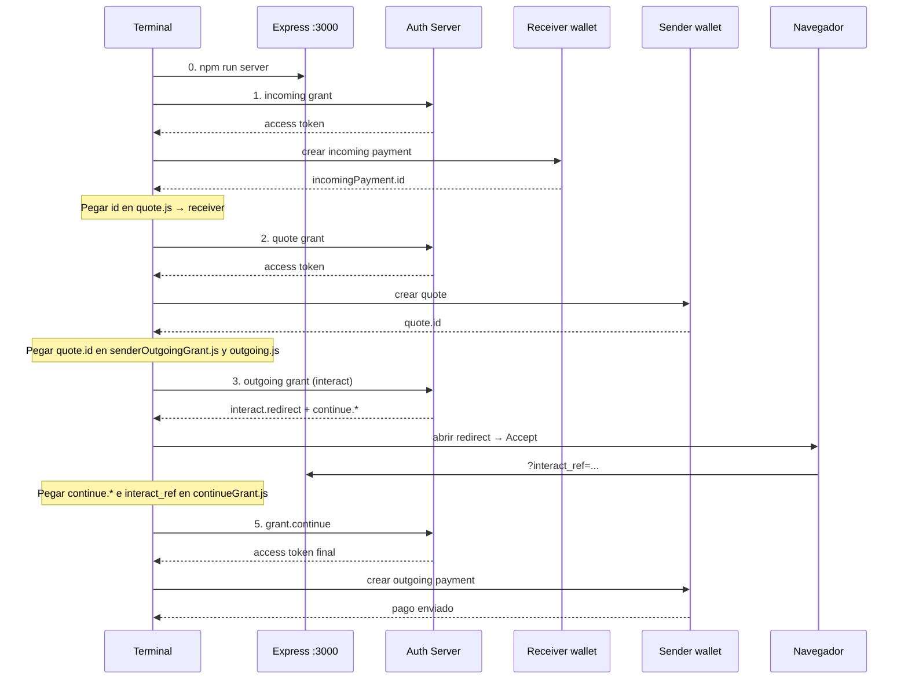

# Interledger: Open Payments

## Que vamos a lograr al final de este taller?

1. Registrarnos en el test wallet de open payments.
2. Crear un wallet para enviar y otro para recibir transferencias.
3. Familiarizarnos con la terminología de interledger.
4. Hacer una transacción desde nuestro editor entre wallets mediante:
    * **4.1** Configuración del proyecto.
    * **4.2** Configuración de los clientes para crear las transacciones entre wallets.
    * **4.3** Montar un servidor con express para capturar la confirmación del usuario.
    * **4.4** Ejecutar la transferencia en orden: server → incoming → quote → interact → outgoing.

## 1 Registrarnos en el test wallet de open payments

Hacer click en: https://wallet.interledger-test.dev/

**Importante**: Solo el correo es necesario que sea real, TODO lo demas puede ser información falsa 

## 2 Crear un wallet para enviar y otro para recibir transferencias

Una vez registrados realizamos click en el botón **"Accounts"** en el panel de la izquierda.<br>
Hacemos click en **"New Account"**, nombramos nuestra nueva cuenta y seleccionamos una moneda.<br>
Creamos **2 wallets**: una para **enviar** (sender) y otra para **recibir** (receiver).

### 2.1 Obtener developer keys

1. En el panel izquierdo, entra a **Settings** → sección de developer keys (o "API / Developer keys" según la UI).
2. Verás un bloque por cada wallet, con:
   - **Payment pointer** (ej. `$ilp.interledger-test.dev/test-walletp`)
   - Nickname / etiqueta (ej. `sender`, `receiver`)
   - **Key ID** (UUID, con botón de copiar)
   - Botones: *Generate public & private key*, *Upload key*, *Revoke*
3. En **cada** wallet, pulsa **"Generate public & private key"** y descarga el archivo de **private key**.
4. Guarda los archivos en la raíz del proyecto con estos nombres (o los que uses en `constants.js`):

| Wallet | Archivo sugerido |
|--------|------------------|
| Sender | `privatesender.key` |
| Receiver | `privatereceiver.key` |

**Importante:** cada wallet tiene su propio trio (Payment pointer + Key ID + private key). No mezcles el Key ID del sender con la private key del receiver (ni al revés). Si regeneras keys en la UI, actualiza **Key ID y archivo `.key`** a la vez.

### 2.2 De la UI a `constants.js` (mapa completo)

En Settings verás algo así (valores de ejemplo):

```text
Payment pointer: $ilp.interledger-test.dev/test-walletp   ← wallet SENDER
Nickname:        sender
Key ID:          db57ba2d-b02a-4f88-913f-13943fbb447e

Payment pointer: $ilp.interledger-test.dev/wallet-usp     ← wallet RECEIVER
Nickname:        receiver
Key ID:          3a773a5a-3948-4fd0-adeb-fb7b29197720
```

Convierte el payment pointer a URL HTTPS reemplazando el `$` inicial por `https://`:

| En la UI (Settings) | Variable en `constants.js` | Ejemplo |
|---------------------|----------------------------|---------|
| Payment pointer del **sender** | `SENDER_WALLET` | `$ilp.../test-walletp` → `https://ilp.interledger-test.dev/test-walletp` |
| Key ID del **sender** | `SENDER_KEY_ID` | `db57ba2d-b02a-4f88-913f-13943fbb447e` |
| Archivo private key del **sender** | `PRIVATE_SENDER_KEY_PATH` | `"./privatesender.key"` |
| Payment pointer del **receiver** | `RECEIVER_WALLET` | `$ilp.../wallet-usp` → `https://ilp.interledger-test.dev/wallet-usp` |
| Key ID del **receiver** | `RECEIVER_KEY_ID` | `3a773a5a-3948-4fd0-adeb-fb7b29197720` |
| Archivo private key del **receiver** | `PRIVATE_RECEIVER_KEY_PATH` | `"./privatereceiver.key"` |

Cómo se usan al crear el cliente autenticado:

| Parámetro de `createAuthenticatedClient` | Variable |
|------------------------------------------|----------|
| `walletAddressUrl` | `SENDER_WALLET` o `RECEIVER_WALLET` |
| `keyId` | `SENDER_KEY_ID` o `RECEIVER_KEY_ID` |
| `privateKey` | `PRIVATE_SENDER_KEY_PATH` o `PRIVATE_RECEIVER_KEY_PATH` |

Si ves `401 invalid_client` / `invalid signature`, casi siempre es un desajuste entre esos tres valores del mismo wallet.

## 3 Familiarizarnos con la terminología de interledger

**Ledger:** Libro contable
**Interledger:** Sistema de pago entre multiples libros contables
**Conector:** Puente entre libros contables
**Ilp:** Interledger protocol
**Grant:** Permiso digital del estandar GNAP

## 4 Crear una transacción desde nuestro editor

### 4.1 Configuración del proyecto

- Creación de proyecto

En nuestro directorio del proyecto
  ```sh
  npm init -y
  ```

- Instalación de dependencias

```sh
npm i @interledger/open-payments uuid express
```

- Dentro de nuestro package.json vamos a editar el objeto scripts para que quede de la siguiente forma:

```json
"scripts": {
    "incoming": "node incoming.js",
    "quote": "node quote.js",
    "interact": "node interact.js",
    "server": "node server.js",
    "outgoing": "node outgoing"
},
```

Opcional: añade `"type": "module"` en `package.json` para evitar el warning `MODULE_TYPELESS_PACKAGE_JSON`.

### 4.2 Configuración de los clientes

1. Coloca en la raíz del proyecto los archivos `.key` descargados (ver sección **2.1**).
2. Rellena `constants.js` con el mapa de la sección **2.2**:

  ```js
  //constants.js
  // Sender (bloque "sender" en Settings)
  export const SENDER_KEY_ID = ""              // Key ID del sender
  export const SENDER_WALLET = ""              // Payment pointer → https://...
  export const PRIVATE_SENDER_KEY_PATH = "./privatesender.key"

  // Receiver (bloque "receiver" en Settings)
  export const RECEIVER_KEY_ID = ""            // Key ID del receiver
  export const RECEIVER_WALLET = ""            // Payment pointer → https://...
  export const PRIVATE_RECEIVER_KEY_PATH = "./privatereceiver.key"
  ```

3. Configuramos los clientes de sender y receiver. Cada cliente usa **solo** las constantes de su wallet:

```js
  //receiver/receiverClient.js
  import { RECEIVER_WALLET, PRIVATE_RECEIVER_KEY_PATH, RECEIVER_KEY_ID } from '../constants.js';

  import { createAuthenticatedClient } from '@interledger/open-payments'

  export const receiverClient = await createAuthenticatedClient({
    walletAddressUrl: RECEIVER_WALLET,       // Payment pointer (https)
    privateKey: PRIVATE_RECEIVER_KEY_PATH,   // ruta a privatereceiver.key
    keyId: RECEIVER_KEY_ID                   // Key ID del receiver
  })
```

Lo mismo aplica al sender (`SENDER_WALLET`, `PRIVATE_SENDER_KEY_PATH`, `SENDER_KEY_ID`).

4. Obtener las referencias a los wallet
```js
//receiverWallet.js
import { RECEIVER_WALLET } from "../constants.js";
import { receiverClient } from "./receiverClient.js";

export const walletReceivingAddress = await receiverClient.walletAddress.get({
    url: RECEIVER_WALLET
})

```

## 4.3 Montar un servidor con express

Este servidor recibe el redirect de Open Payments tras pulsar **Accept** y muestra el `interact_ref` en consola. Debe estar **corriendo antes** de abrir el link de interacción.

```js
// server.js
import express from 'express';

const app = express();

app.use((req) => {
  console.dir(req.query.interact_ref) // UUID que copiarás a continueGrant.js
})

app.listen(3000, () => console.dir('Running at port 3000'))
```

## 4.4 Paso a paso de una transferencia

Orden de ejecución (usa **2 terminales**: una para el server y otra para los scripts):

| Paso | Comando | Qué hace |
|------|---------|----------|
| 0 | `npm run server` | Escucha en `http://localhost:3000` el `interact_ref` |
| 1 | `npm run incoming` | Crea el **incoming payment** (pago a recibir) |
| 2 | `npm run quote` | Crea el **quote** (cotización del envío) |
| 3 | `npm run interact` | Pide permiso de pago y genera el **link de Accept** |
| 4 | (navegador + server) | Confirmas el pago; el server imprime `interact_ref` |
| 5 | `npm run outgoing` | Continúa el grant y crea el **outgoing payment** |



### Tabla rápida: qué copiar y a dónde

| Origen | Campo / valor | Pegar en | Campo del código |
|--------|---------------|----------|------------------|
| Consola de `incoming` | `id` | `quote.js` | `receiver` |
| Consola de `quote` | `id` | `sender/senderOutgoingGrant.js` | `limits.quoteId` |
| Consola de `quote` | `id` (mismo) | `outgoing.js` | `quoteId` |
| Consola de `interact` | `interact.redirect` | Navegador | Abrir URL y pulsar Accept |
| Consola de `interact` | `continue.access_token.value` | `sender/continueGrant.js` | `accessToken` |
| Consola de `interact` | `continue.uri` | `sender/continueGrant.js` | `url` |
| Consola del `server` | `interact_ref` | `sender/continueGrant.js` | `interact_ref` |

---

### Paso 0 — Levantar el servidor

En una terminal (no la cierres):

```sh
npm run server
```

Debes ver: `Running at port 3000`.

---

### Paso 1 — Crear incoming payment (`npm run incoming`)

**Qué hace:** pide un grant de `incoming-payment` al auth server del **receiver** y crea un pago entrante (ej. valor `1000` en la escala del asset del wallet).

**Archivos clave:**
- `receiver/receiverGrant.js` → `getReceivingGrant()`
- `incoming.js` → crea el payment con ese grant

**Ejecutar:**

```sh
npm run incoming
```

**Qué copiar:** de la respuesta, el campo `id` (URL del incoming payment), por ejemplo:

```text
https://ilp.interledger-test.dev/.../incoming-payments/<uuid>
```

**Dónde pegarlo:** en `quote.js`, campo `receiver`:

```js
receiver: "" // ← pega aquí el id de incoming
```

---

### Paso 2 — Crear quote (`npm run quote`)

**Qué hace:** pide un grant de tipo `quote` al auth server del **sender** y calcula cuánto se debitará para pagar ese incoming payment.

**Archivos clave:**
- `sender/senderQuoteGrant.js` → `getQuoteGrant()`
- `quote.js` → crea el quote (usa el `receiver` del paso 1)

**Ejecutar:**

```sh
npm run quote
```

**Qué copiar:** el campo `id` del quote.

**Dónde pegarlo (mismo valor en dos sitios):**

1. `sender/senderOutgoingGrant.js` → `limits.quoteId`
2. `outgoing.js` → `quoteId`

```js
// senderOutgoingGrant.js
limits: {
  quoteId: "" // ← id del quote
}

// outgoing.js
quoteId: "" // ← el mismo id del quote
```

---

### Paso 3 — Generar link de interacción (`npm run interact`)

**Qué hace:** solicita un grant de `outgoing-payment` limitado a ese `quoteId`. Como implica mover dinero, el auth server exige consentimiento del usuario y devuelve una URL de redirect.

**Archivos clave:**
- `sender/senderOutgoingGrant.js` → grant con `interact.finish.uri = http://localhost:3000`
- `interact.js` → imprime la respuesta del grant

**Requisito:** el servidor del paso 0 debe seguir activo.

**Ejecutar:**

```sh
npm run interact
```

**Qué copiar de la respuesta:**

| Campo | Uso |
|-------|-----|
| `interact.redirect` | Abrir en el navegador |
| `continue.access_token.value` | → `continueGrant.js` → `accessToken` |
| `continue.uri` | → `continueGrant.js` → `url` |

---

### Paso 4 — Confirmar en el navegador (Accept)

1. Abre la URL de `interact.redirect`.
2. Pulsa **Accept**.
3. El navegador redirige a `http://localhost:3000/?interact_ref=...`.
4. En la terminal del **server** aparece el UUID de `interact_ref`.

**Dónde pegarlo:** `sender/continueGrant.js` → `interact_ref`:

```js
// sender/continueGrant.js
export const getContinueGrant = async () => {
  return await senderClient.grant.continue(
    {
      accessToken: "", // ← continue.access_token.value (paso 3)
      url: ""          // ← continue.uri (paso 3)
    },
    {
      interact_ref: "" // ← UUID impreso por el server (paso 4)
    }
  )
}
```

---

### Paso 5 — Crear outgoing payment (`npm run outgoing`)

**Qué hace:** continúa el grant con el `interact_ref` (consentimiento ya dado) y crea el pago saliente usando el `quoteId`.

**Archivos clave:**
- `sender/continueGrant.js` → `getContinueGrant()`
- `outgoing.js` → `outgoingPayment.create(...)`

**Ejecutar:**

```sh
npm run outgoing
```

Si todo va bien, la consola muestra el outgoing payment (`id`, `sentAmount`, `failed: false`, etc.) y el saldo debería moverse en el test wallet.

---

### Resumen de comandos (checklist)

```sh
# Terminal 1
npm run server

# Terminal 2 (después de cada pegado de IDs)
npm run incoming   # → copiar id → quote.js (receiver)
npm run quote      # → copiar id → senderOutgoingGrant.js + outgoing.js
npm run interact   # → abrir redirect; copiar continue.* → continueGrant.js
                   # → Accept; copiar interact_ref del server → continueGrant.js
npm run outgoing
```

**Notas:**
- Los `id` de incoming/quote suelen caducar; si falla un paso tardío, vuelve a generar desde `incoming`.
- `401 invalid_client` / `invalid signature` → revisa el mapa wallet / Key ID / `.key` de la sección **2.2**.
- No mezcles tokens de un `interact` viejo con un `interact_ref` nuevo: regenera el paso 3 y 4 juntos.
